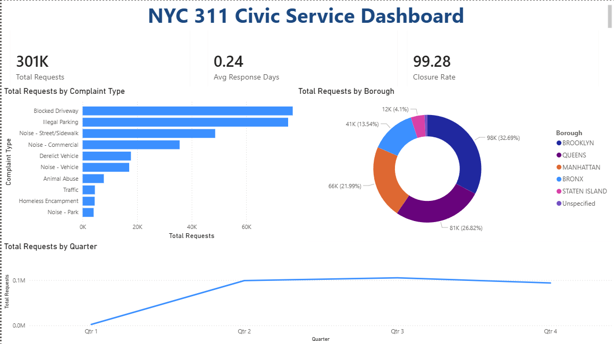
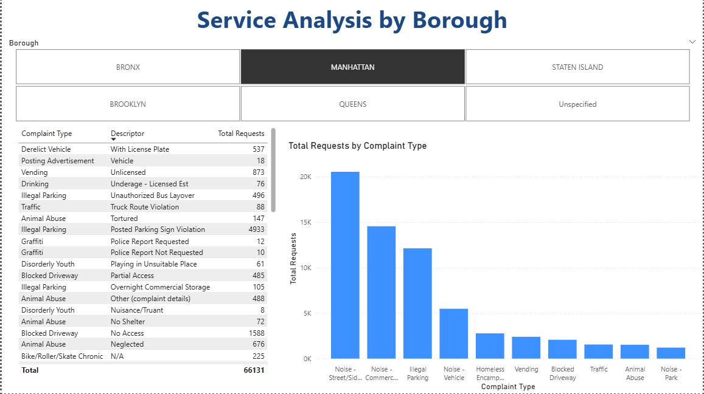
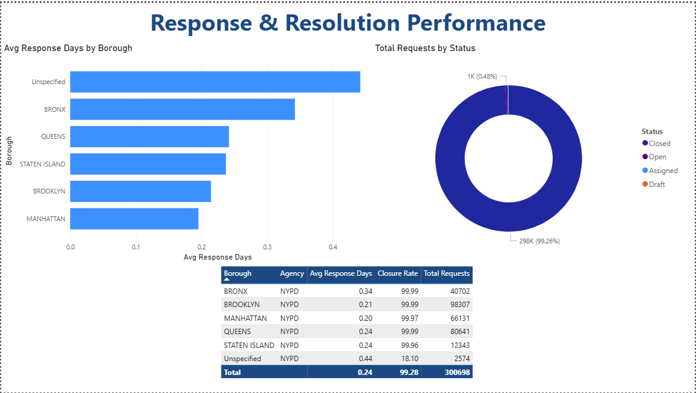

# NYC 311 Civic Service Dashboard

Interactive Power BI dashboard analyzing 300,000+ NYC 311 service requests to uncover complaint patterns, borough-level trends, and government response performance.

## Dashboard Pages

### Civic Service Overview

KPI cards for total requests, closure rate, and average response time. Top complaint types, borough distribution, and monthly volume trends.

### Service Analysis

Interactive borough slicer filtering all visuals. Complaint type breakdown and detailed request table.

### Response & Resolution

Response time comparison by borough, request status breakdown, and agency performance scorecard.

## Tools & Techniques
- **Power BI Desktop** — dashboard development
- **Power Query** — data cleaning (53 columns reduced to 15)
- **DAX** — custom measures (COUNTROWS, AVERAGEX, CALCULATE/DIVIDE)

## Data
[NYC 311 Service Requests](https://www.kaggle.com/datasets/shubhammore12/nyc-311-customer-service-requests-analysis) — 300,698 records across all five NYC boroughs
